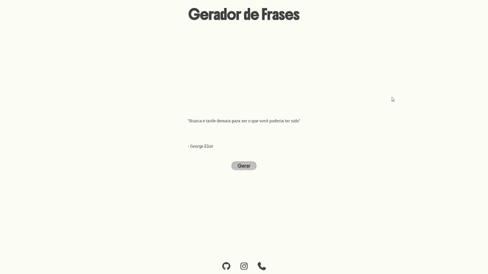

# 💬 Gerador de Frases

 

[](https://tiago-neumann.github.io/01_gerador_de_frases/) 

> Um gerador de frases aleatórias desenvolvido com **HTML, CSS e JavaScript**, utilizando dados externos em formato JSON.

<div align="center">


</div>

---

## 📌 Sobre o projeto

O **Gerador de Frases** é uma aplicação web simples que exibe frases aleatórias sempre que o usuário clica no botão **"Gerar"**.

As frases são obtidas através de um arquivo JSON hospedado no GitHub e carregadas dinamicamente utilizando a função `fetch()` do JavaScript.

O projeto foi desenvolvido com o objetivo de praticar:

* Manipulação do DOM;
* JavaScript assíncrono;
* Consumo de dados externos;
* Utilização de `async/await`;
* Tratamento de erros com `try/catch`;
* Estruturação de páginas com HTML e CSS.

---

## ✨ Funcionalidades

* 🎲 Geração de frases aleatórias;
* 👤 Exibição do autor da frase;
* 🔄 Nova frase a cada clique;
* 🌐 Consumo de dados externos;
* ⚡ Carregamento automático de uma frase ao abrir a página;
* 📱 Interface adaptável para diferentes tamanhos de tela.

---

## 🖥️ Demonstração

<div align="center">

<!-- Adicione aqui uma screenshot ou GIF do projeto -->


</div>

> 💡 Caso ainda não tenha uma imagem, você pode tirar um print da aplicação e salvá-lo como `assets/preview.png`.

---

## 🛠️ Tecnologias utilizadas

| Tecnologia         | Utilização               |
| ------------------ | ------------------------ |
| 🟧 **HTML5**       | Estrutura da aplicação   |
| 🟦 **CSS3**        | Estilização e layout     |
| 🟨 **JavaScript**  | Lógica e interação       |
| 🔗 **Fetch API**   | Requisição dos dados     |
| 📄 **JSON**        | Armazenamento das frases |
| ⭐ **Font Awesome** | Ícones das redes sociais |

---

## ⚙️ Como funciona?

O funcionamento da aplicação é relativamente simples:

```text
Usuário acessa a página
        ↓
JavaScript é executado
        ↓
fetch() solicita o arquivo JSON
        ↓
Dados são convertidos para JavaScript
        ↓
Uma frase aleatória é selecionada
        ↓
Frase + autor são exibidos na página
        ↓
Usuário pode gerar outra frase
```

A seleção da frase acontece utilizando:

```javascript
const aleatoria = data[Math.floor(Math.random() * data.length)];
```

O `Math.random()` gera um número aleatório, enquanto o `Math.floor()` transforma esse resultado em um índice válido do array de frases.

---

## 🌐 Fonte dos dados

As frases utilizadas pelo projeto são obtidas através do seguinte arquivo JSON:

**devmatheusguerra/frasesJSON**

O projeto realiza uma requisição para o arquivo utilizando a `Fetch API`:

```javascript
const res = await fetch(
  'https://raw.githubusercontent.com/devmatheusguerra/frasesJSON/main/frases.json'
);
```

---

## 🚀 Como executar o projeto

### 1. Clone o repositório

```bash
git clone https://github.com/SEU-USUARIO/SEU-REPOSITORIO.git
```

### 2. Entre na pasta

```bash
cd SEU-REPOSITORIO
```

### 3. Execute o projeto

Como o projeto utiliza apenas HTML, CSS e JavaScript, não é necessário instalar dependências.

Você pode simplesmente abrir o arquivo:

```text
index.html
```

Ou utilizar uma extensão como **Live Server** no VS Code.

---

## 📂 Estrutura do projeto

```text
gerador-de-frases/
│
├── index.html
├── style.css
├── main.js
│
└── assets/
    └── preview.png
```

---

## 📚 O que aprendi com este projeto

Durante o desenvolvimento, foram praticados conceitos importantes de JavaScript, principalmente relacionados ao consumo de dados externos.

### `async/await`

Utilizado para trabalhar com operações assíncronas de maneira mais simples e legível:

```javascript
const res = await fetch(url);
const data = await res.json();
```

### `try/catch`

Utilizado para tratar possíveis erros durante a requisição:

```javascript
try {
    // requisição
} catch (erro) {
    console.error(erro);
}
```

### Manipulação do DOM

A frase e o autor são inseridos diretamente nos elementos HTML através do `textContent`:

```javascript
document.getElementById('frase').textContent = `"${aleatoria.frase}"`;
document.getElementById('autor').textContent = `- ${aleatoria.autor}`;
```

---

## 🔮 Melhorias futuras

Algumas funcionalidades que podem ser adicionadas futuramente:

* [ ] 📋 Botão para copiar a frase;
* [ ] ❤️ Sistema de frases favoritas;
* [ ] 🔗 Compartilhamento da frase;
* [ ] 🌙 Modo escuro;
* [ ] 🎨 Animações durante a troca de frases;
* [ ] 🔍 Filtro por categoria;
* [ ] 📱 Melhorias de responsividade;
* [ ] 💾 Armazenamento das frases favoritas no `localStorage`.

---

## 👨‍💻 Autor

Desenvolvido por **Tiago Neumann**.

<div align="center">

[](https://github.com/tiago-neumann)
[](https://www.instagram.com/_tiagoneumann/)

</div>

---

<div align="center">

⭐ Se este projeto foi útil ou interessante, considere deixar uma estrela no repositório!

</div>
